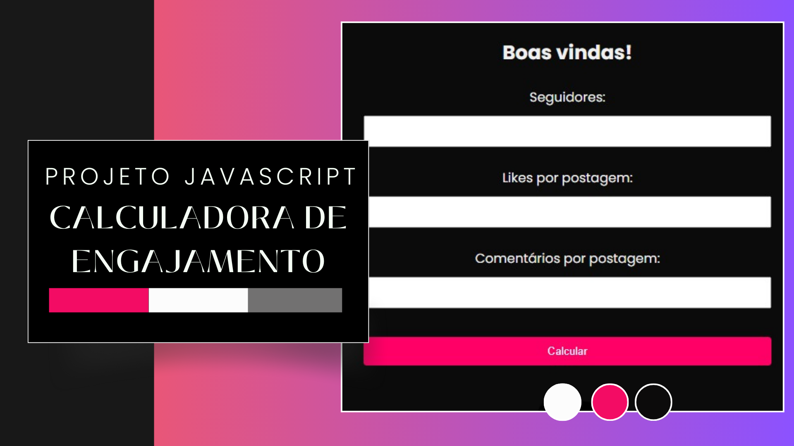

 

## 🖥️ Projeto

A "Calculadora de Engajamento do Instagram" é uma aplicação web projetada para ajudar os usuários a calcular o engajamento de suas contas no Instagram com base no número de seguidores, likes por postagem e comentários por postagem. Esta calculadora é útil para influenciadores, profissionais de marketing e qualquer pessoa interessada em analisar o desempenho de suas contas no Instagram.

### 🔎 Tecnologias

Esse projeto foi desenvolvido com as seguintes tecnologias:

- HTML
- CSS
- JavaScript
- Github

## 🎨 Instruções

- Preencha o campo "Seguidores" com o número total de seguidores em sua conta do Instagram.
- Preencha o campo "Likes por postagem" com o número médio de likes que suas postagens recebem.
- Preencha o campo "Comentários por postagem" com o número médio de comentários que suas postagens recebem.
- Clique no botão "Calcular" para obter o resultado do engajamento.
- O resultado será exibido abaixo do botão, indicando a porcentagem de engajamento de sua conta no Instagram.

### 🧑‍💻 Creditos

Professor [Luan Oliveira](https://www.linkedin.com/in/luanpdd/).